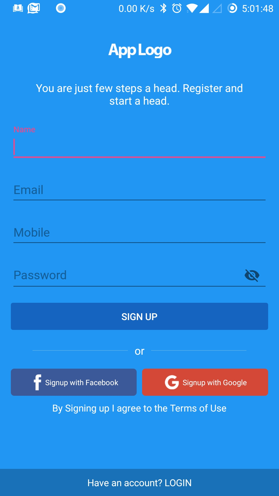
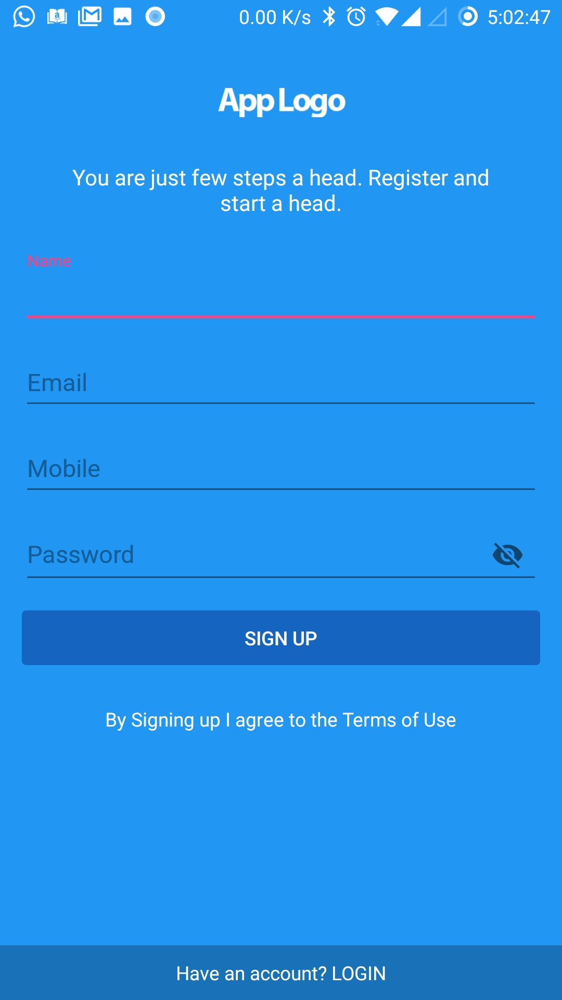
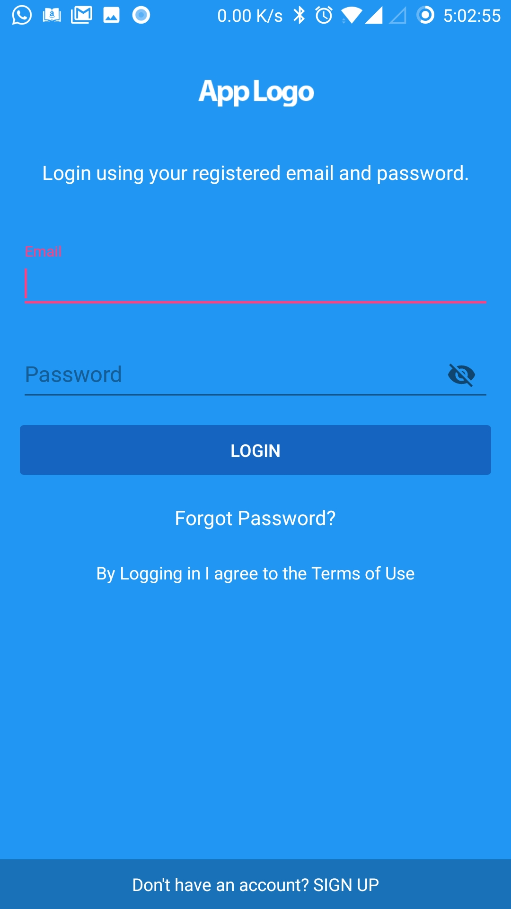
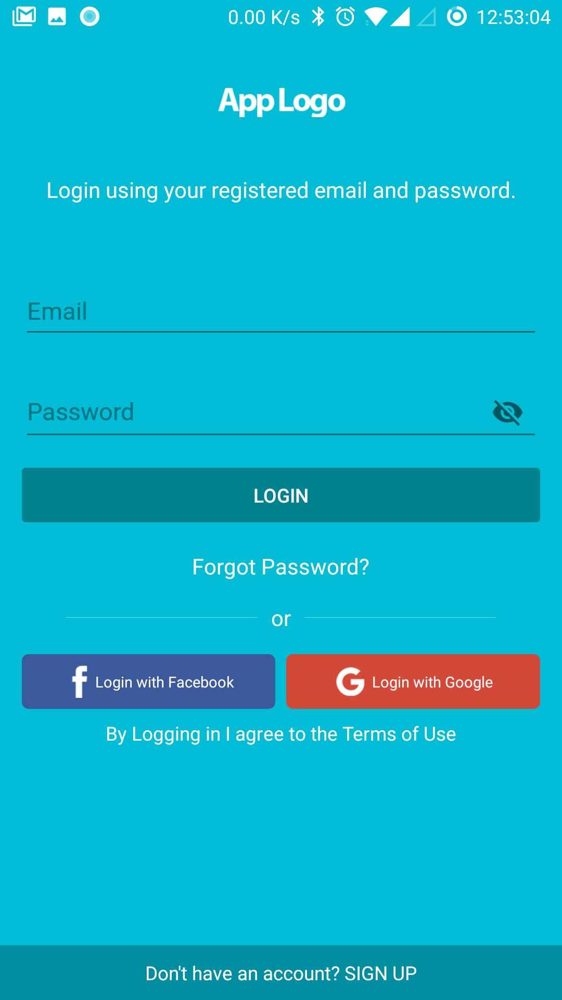
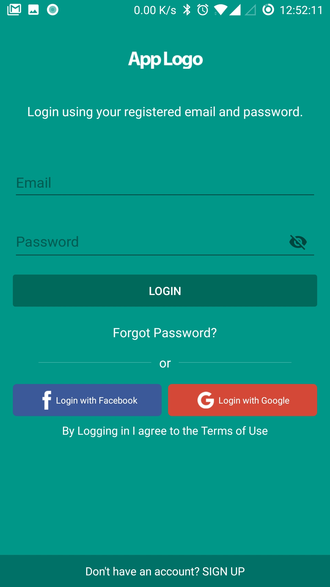
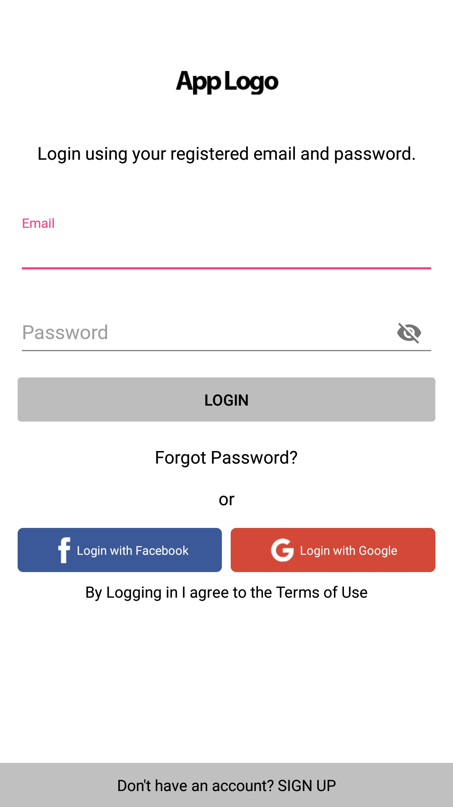

# kotlin-auth-ui
Android Kotlin App Auth Template(Login, Signup and Forgot Password) UI Edit

[ ](https://bintray.com/sayagodshala/maven/kotlin-auth-ui/_latestVersion)
[](https://www.apache.org/licenses/LICENSE-2.0.html)
<!--[](https://travis-ci.org/sayagodshala/kotlin-auth-ui)-->
[](https://android-arsenal.com/api?level=15)

# What's in the box

- The login, signup and forgot password UI Template for your app
- Easy way to implement
- Play with element visibility
- Setup material theme like Teal, Cyan, Indigo and many more.
- Hide and Show social logins.

<!--[ ](https://bintray.com/sayagodshala/maven/auth-ui/_latestVersion)-->
<!--[](https://www.apache.org/licenses/LICENSE-2.0.html)-->
<!--[](https://android-arsenal.com/details/1/5607)-->
<!--[](https://travis-ci.org/aromajoin/actionsheet-android)-->

<!--[](https://android-arsenal.com/details/1/3026)-->

<!---->

Basic Form | Signup without Social Platforms | Login without Social Platforms
---- | ---- | ----
 |  | 

### Themes

CYAN | TEAL | WHITE/DEFAULT
---- | ---- | ----
 |  | 

# Setup
## 1. Include in your project

### Using Gradle
The **Auth UI** library is pushed to jcenter, so you need to add the following dependency to your app's `build.gradle`.

```gradle
compile 'com.sayagodshala:kotlin-auth-ui:1.0'
```

### As a module
If you can't include it as gradle dependency, you can also download this GitHub repo and copy the auth-ui folder to your project.


## 2. Usage

First step in configuring the Auth UI Framework is to place `FrameLayout Container` in your layout.

```xml
<FrameLayout
        android:id="@+id/frame"
        android:layout_width="match_parent"
        android:layout_height="match_parent"/>
```

Next step is to configure the `AuthUISettings`.

Example:

```kotlin
val authUISettings = AuthUISettings()
authUISettings.isSocialPlatformRequired = true
authUISettings.isAppLogoRequired = true
authUISettings.isTermsRequired = true
authUISettings.isSignupRequired = true
authUISettings.isFacebookLoginRequired = true
authUISettings.isGoogleLoginRequired = true
authUISettings.isForgotPasswordRequired = true
authUISettings.appLogo = R.mipmap.my_logo
authUISettings.loginTitle = getString(R.string.login_title)
authUISettings.signupTitle = getString(R.string.signup_title)
authUISettings.forgotPasswordTitle = getString(R.string.forgot_password_title)
authUISettings.loginTerms = getString(R.string.loggin_terms)
authUISettings.signupTerms = getString(R.string.signup_terms)
authUISettings.facebookLoginTitle = getString(R.string.login_with_facebook)
authUISettings.facebookSignupTitle = getString(R.string.signup_with_facebook)
authUISettings.googleLoginTitle = getString(R.string.login_with_google)
authUISettings.googleSignupTitle = getString(R.string.signup_with_google)
authUISettings.loginToggleTitle = getString(R.string.have_an_account)
authUISettings.signupToggleTitle = getString(R.string.dont_have_account)
authUISettings.defaultView = AuthUIView.LOGIN
authUISettings.materialTheme = MaterialTheme.GREEN
```
Next step is to load the `AuthUIFragment` in your Activity.

```kotlin
// declare instance of AuthUIFragment
private var authUIFragment: AuthUIFragment? = null
// load fragment with your own settings or default settings
authUIFragment = AuthUIFragment.newInstance(authUISettings);
**OR**
authUIFragment = AuthUIFragment.newInstanceWithDefaultSettings()

// load authUIFragment into the frame layout
AuthUIFragment.loadFragment(this, authUIFragment!!, R.id.frame);
```

Final step is to implement `AuthUIFragmentListener` interface in your target activity where `AuthUIFragment` is loaded with corresponding methods.

```kotlin
class LoginActivity : AppCompatActivity(), AuthUIFragmentListener {

    override fun onLoginClicked(user: AuthUIUser) {
        when (user.loginType) {
            LoginType.EMAIL -> Log.d("onLoginClicked", "email : " + user.email + ", password : " + user.password)
            LoginType.MOBILE -> Log.d("onLoginClicked", "mobile : " + user.mobile + ", password : " + user.password)
            LoginType.EMAIL_OR_MOBILE -> Log.d("onLoginClicked", "email/mobile : " + user.emailOrMobile + ", password : " + user.password)
        }
    }

    override fun onSignupClicked(user: AuthUIUser) {
        Log.d("onSignupClicked", "name : " + user.name + ", email : " + user.email + ", mobile : " + user.mobile + ", password : " + user.password)
    }

    override fun onForgotPasswordClicked(user: AuthUIUser) {
        Log.d("onForgotPasswordClicked", "email : " + user.email)
        authUIFragment!!.recallLoginView()
    }

    override fun onSocialAccountClicked(socialAccount: SocialAccount, isRegistration: Boolean) {
        Log.d("onSocialAccountClicked", "socialAccount : " + socialAccount.name + ", isRegistration : " + isRegistration)
        when (socialAccount) {
            SocialAccount.FACEBOOK -> {
            }
            SocialAccount.GOOGLE -> {
            }
        }
    }

    override fun onFormValidationError(error: String) {
        Log.d("onFormValidationError", "error : " + error)
    }

}
```
This is the simplest way to configure the library to enable Custom login mode along with Social Platform login modes.

**That's it!**

# More about AuthUISettings

Login Types(EMAIL,MOBILE and EMAIL_OR_MOBILE). Default login type is EMAIL.

```kotlin
authUISettings.loginType = LoginType.EMAIL;
**OR**
authUISettings.loginType = LoginType.MOBILE;
**OR**
authUISettings.loginType = LoginType.EMAIL_OR_MOBILE;
```

To hide social platforms use below code

```kotlin
authUISettings.isSocialPlatformRequired = false;
```

To hide App logo

```kotlin
authUISettings.isAppLogoRequired = false;
```

In case your app only requires login

```kotlin
authUISettings.isSignupRequired = false;
```

In case your app only requires one of the below

```kotlin
authUISettings.isFacebookLoginRequired = false;
**OR**
authUISettings.isGoogleLoginRequired = false;
```

In case you want to handle the form validation error message

```kotlin
authUISettings.isHandleFormError = true;
// once it is set to true, implement your logic in 'onFormValidationError(String message)' method of AuthUIFragmentListener interface
```

In case your app doesn't require forgot password

```kotlin
authUISettings.isForgotPasswordRequired = true;
```

Set your default view

```kotlin
authUISettings.defaultView = AuthUIView.LOGIN;
**OR**
authUISettings.defaultView = AuthUIView.SIGNUP;
```

Supported Themes (Default Theme is WHITE)

```kotlin
authUISettings.materialTheme = MaterialTheme.DEFAULT;
**OR**
authUISettings.materialTheme = MaterialTheme.WHITE;
**OR**
authUISettings.materialTheme = MaterialTheme.RED;
```

and many more like PINK,PURPLE,DEEP_PURPLE,INDIGO,BLUE,LIGHT_BLUE,CYAN,TEAL,BLUE_GREY,YELLOW,AMBER,BROWN,GREEN and GREY.

# Included Libraries
The following third-party libraries were used in this framework.

- GSON library


# Contribution
All contributions are welcome. Encounter any issue? Don't hesitate to [open an issue](https://github.com/sayagodshala/auth-ui/issues)

Convention: **Master branch** would be the development branch. So feel free to fork from the Master branch.

# License

    Copyright 2017 Codelight Studios

    Licensed under the Apache License, Version 2.0 (the "License");
    you may not use this file except in compliance with the License.
    You may obtain a copy of the License at

       http://www.apache.org/licenses/LICENSE-2.0

    Unless required by applicable law or agreed to in writing, software
    distributed under the License is distributed on an "AS IS" BASIS,
    WITHOUT WARRANTIES OR CONDITIONS OF ANY KIND, either express or implied.
    See the License for the specific language governing permissions and
    limitations under the License.